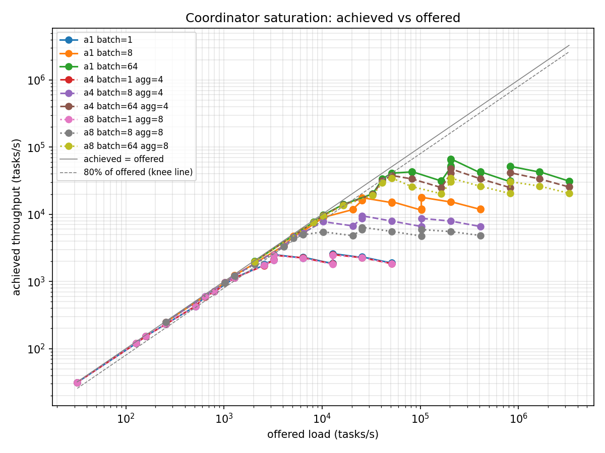

# Coordinator saturation x aggregator shards

Every number below is computed from the JSON reports under
`bench-results-sharded/` attached to this stage (`a1/rep1..rep3`,
`a4/rep1`, `a8/rep1`; 48 reports per rep, 240 total). No numbers from
memory, no re-runs. Environment (recorded in every report's `env`
block): Vultr dedicated-CPU, 32 vCPU, Python 3.12.3, ray 2.50.0 - the
same instance class as BASELINE.

Grid: identical to BASELINE (latency {0.5, 0.1, 0.02, 0.005} s x
workers {16, 64, 128, 256} x batch {1, 8, 64}, `fail_rate = 0`), run at
`--aggregator-shards` 1 / 4 / 8, `--decider-shards 1` throughout. Rep
counts: **a1 = 3 reps** (regression anchor), **a4 = 1 rep, a8 = 1 rep**
(box time; the runbook allowed 1 minimum - single-rep numbers below
carry no spread and should be read with the a1 worst-case per-rep
spread of 5.2% in mind, at `a1 w64/l0.02/b64`: 50,279.8-52,957.0).
Shard settings are read from each report's recorded `args`, never from
filenames.

## The a1 anchor does not reproduce BASELINE - by design

The runbook's mid-flight sanity values (b=1 knee at 2,560, b=8 at
4,096, b=64 at 8,192) date from the baseline, and **the write batching (batched `record_batch`
writes) landed between BASELINE and this sweep.** The a1 setting is the
batched-write single-shard configuration, and it is the correct "before" for
the shard overlay - but it is 3.6-13x above the baseline curves wherever the
old per-result `add_result` path was the ceiling:

| batch | baseline ceiling (t/s) | a1 ceiling (t/s, mean) | baseline knee | a1 knee |
|------:|------------------:|-----------------------:|---------:|--------:|
| 1  | 2,701.0  | 2,568.3  | 2,560 | 2,560 |
| 8  | 4,911.0  | 17,785.5 | 4,096 (marginal) | 20,480 |
| 64 | 4,873.3  | 65,624.8 | 8,192 | 32,768 (marginal) |

Where write batching changes little, a1 does anchor against BASELINE: on the
batch=1 curve every unsaturated point matches the baseline within 0.5% (e.g.
w64/l0.1: 594.5 -> 594.9), and the b=1 knee is unchanged at offered
2,560. The deep b=1 points run 1.0-5.1% *below* the baseline (w64/l0.005:
2,687.3 -> 2,568.3, -4.4%; w256/l0.02: -5.1%) - consistent with batching's
`record_batch` paying a per-call payload/shard-hash cost that at
batch=1 replaces a cheaper per-result call one-for-one. The a1 per-rep
spread is also wider than BASELINE's (<= 5.2% vs <= 1.5%), worst at
knee-adjacent b=64 points; single-rep a4/a8 deltas smaller than ~5%
should not be over-read.

## Achieved vs offered, per shard setting

Reproduce all curves and knees with:

    python -m bench.plot_saturation --compare \
        bench-results-sharded/a1 bench-results-sharded/a4 \
        bench-results-sharded/a8 --out bench/results/sharded_overlay.png

(`--compare` now takes two or more paths, and curves are keyed by the
shard settings in each report's args - both changed in this stage.)

### a1: batch = 1

| workers | latency (s) | offered (t/s) | achieved (t/s, mean of 3) | achieved/offered |
|--------:|------------:|--------------:|--------------------------:|-----------------:|
| 16 | 0.5 | 32 | 31.5 | 0.985 |
| 64 | 0.5 | 128 | 120.4 | 0.941 |
| 16 | 0.1 | 160 | 153.6 | 0.960 |
| 128 | 0.5 | 256 | 232.4 | 0.908 |
| 256 | 0.5 | 512 | 428.9 | 0.838 |
| 64 | 0.1 | 640 | 594.9 | 0.929 |
| 16 | 0.02 | 800 | 707.3 | 0.884 |
| 128 | 0.1 | 1,280 | 1,129.7 | 0.883 |
| 256 | 0.1 | 2,560 | 1,774.7 | 0.693 |
| 16 | 0.005 | 3,200 | 2,100.6 | 0.656 |
| 64 | 0.02 | 3,200 | 2,500.7 | 0.781 |
| 128 | 0.02 | 6,400 | 2,271.7 | 0.355 |
| 64 | 0.005 | 12,800 | 2,568.3 | 0.201 |
| 256 | 0.02 | 12,800 | 1,861.6 | 0.145 |
| 128 | 0.005 | 25,600 | 2,294.5 | 0.090 |
| 256 | 0.005 | 51,200 | 1,888.0 | 0.037 |

### a1: batch = 8

| workers | latency (s) | offered (t/s) | achieved (t/s, mean of 3) | achieved/offered |
|--------:|------------:|--------------:|--------------------------:|-----------------:|
| 16 | 0.5 | 256 | 248.9 | 0.972 |
| 64 | 0.5 | 1,024 | 962.3 | 0.940 |
| 16 | 0.1 | 1,280 | 1,227.7 | 0.959 |
| 128 | 0.5 | 2,048 | 1,852.7 | 0.905 |
| 256 | 0.5 | 4,096 | 3,433.8 | 0.838 |
| 64 | 0.1 | 5,120 | 4,732.4 | 0.924 |
| 16 | 0.02 | 6,400 | 5,594.3 | 0.874 |
| 128 | 0.1 | 10,240 | 8,962.2 | 0.875 |
| 256 | 0.1 | 20,480 | 11,843.9 | 0.578 |
| 16 | 0.005 | 25,600 | 16,134.8 | 0.630 |
| 64 | 0.02 | 25,600 | 17,575.5 | 0.687 |
| 128 | 0.02 | 51,200 | 15,147.6 | 0.296 |
| 64 | 0.005 | 102,400 | 17,785.5 | 0.174 |
| 256 | 0.02 | 102,400 | 11,838.6 | 0.116 |
| 128 | 0.005 | 204,800 | 15,339.3 | 0.075 |
| 256 | 0.005 | 409,600 | 11,946.3 | 0.029 |

### a1: batch = 64

| workers | latency (s) | offered (t/s) | achieved (t/s, mean of 3) | achieved/offered |
|--------:|------------:|--------------:|--------------------------:|-----------------:|
| 16 | 0.5 | 2,048 | 1,987.3 | 0.970 |
| 64 | 0.5 | 8,192 | 7,669.2 | 0.936 |
| 16 | 0.1 | 10,240 | 9,707.1 | 0.948 |
| 128 | 0.5 | 16,384 | 14,013.0 | 0.855 |
| 256 | 0.5 | 32,768 | 20,188.4 | 0.616 |
| 64 | 0.1 | 40,960 | 33,433.2 | 0.816 |
| 16 | 0.02 | 51,200 | 40,970.6 | 0.800 |
| 128 | 0.1 | 81,920 | 42,983.1 | 0.525 |
| 256 | 0.1 | 163,840 | 31,450.1 | 0.192 |
| 16 | 0.005 | 204,800 | 65,624.8 | 0.320 |
| 64 | 0.02 | 204,800 | 51,497.1 | 0.251 |
| 128 | 0.02 | 409,600 | 42,450.3 | 0.104 |
| 64 | 0.005 | 819,200 | 51,274.9 | 0.063 |
| 256 | 0.02 | 819,200 | 31,115.6 | 0.038 |
| 128 | 0.005 | 1,638,400 | 42,774.8 | 0.026 |
| 256 | 0.005 | 3,276,800 | 31,234.2 | 0.010 |

### a4: batch = 1

| workers | latency (s) | offered (t/s) | achieved (t/s, 1 rep) | achieved/offered |
|--------:|------------:|--------------:|----------------------:|-----------------:|
| 16 | 0.5 | 32 | 31.5 | 0.985 |
| 64 | 0.5 | 128 | 120.5 | 0.941 |
| 16 | 0.1 | 160 | 153.6 | 0.960 |
| 128 | 0.5 | 256 | 231.3 | 0.903 |
| 256 | 0.5 | 512 | 428.5 | 0.837 |
| 64 | 0.1 | 640 | 590.5 | 0.923 |
| 16 | 0.02 | 800 | 706.4 | 0.883 |
| 128 | 0.1 | 1,280 | 1,128.6 | 0.882 |
| 256 | 0.1 | 2,560 | 1,722.6 | 0.673 |
| 16 | 0.005 | 3,200 | 2,094.2 | 0.654 |
| 64 | 0.02 | 3,200 | 2,460.1 | 0.769 |
| 128 | 0.02 | 6,400 | 2,250.0 | 0.352 |
| 64 | 0.005 | 12,800 | 2,516.2 | 0.197 |
| 256 | 0.02 | 12,800 | 1,829.5 | 0.143 |
| 128 | 0.005 | 25,600 | 2,258.2 | 0.088 |
| 256 | 0.005 | 51,200 | 1,842.4 | 0.036 |

### a4: batch = 8

| workers | latency (s) | offered (t/s) | achieved (t/s, 1 rep) | achieved/offered |
|--------:|------------:|--------------:|----------------------:|-----------------:|
| 16 | 0.5 | 256 | 248.5 | 0.971 |
| 64 | 0.5 | 1,024 | 962.0 | 0.939 |
| 16 | 0.1 | 1,280 | 1,216.9 | 0.951 |
| 128 | 0.5 | 2,048 | 1,833.8 | 0.895 |
| 256 | 0.5 | 4,096 | 3,353.3 | 0.819 |
| 64 | 0.1 | 5,120 | 4,583.7 | 0.895 |
| 16 | 0.02 | 6,400 | 5,289.6 | 0.826 |
| 128 | 0.1 | 10,240 | 7,770.8 | 0.759 |
| 256 | 0.1 | 20,480 | 6,724.5 | 0.328 |
| 16 | 0.005 | 25,600 | 9,482.4 | 0.370 |
| 64 | 0.02 | 25,600 | 8,701.2 | 0.340 |
| 128 | 0.02 | 51,200 | 7,935.0 | 0.155 |
| 64 | 0.005 | 102,400 | 8,697.6 | 0.085 |
| 256 | 0.02 | 102,400 | 6,588.2 | 0.064 |
| 128 | 0.005 | 204,800 | 7,923.0 | 0.039 |
| 256 | 0.005 | 409,600 | 6,579.4 | 0.016 |

### a4: batch = 64

| workers | latency (s) | offered (t/s) | achieved (t/s, 1 rep) | achieved/offered |
|--------:|------------:|--------------:|----------------------:|-----------------:|
| 16 | 0.5 | 2,048 | 1,982.2 | 0.968 |
| 64 | 0.5 | 8,192 | 7,564.9 | 0.923 |
| 16 | 0.1 | 10,240 | 9,570.9 | 0.935 |
| 128 | 0.5 | 16,384 | 13,819.9 | 0.844 |
| 256 | 0.5 | 32,768 | 19,742.3 | 0.602 |
| 64 | 0.1 | 40,960 | 31,514.4 | 0.769 |
| 16 | 0.02 | 51,200 | 37,810.1 | 0.738 |
| 128 | 0.1 | 81,920 | 33,655.3 | 0.411 |
| 256 | 0.1 | 163,840 | 25,009.4 | 0.153 |
| 16 | 0.005 | 204,800 | 47,521.8 | 0.232 |
| 64 | 0.02 | 204,800 | 40,706.2 | 0.199 |
| 128 | 0.02 | 409,600 | 33,749.0 | 0.082 |
| 64 | 0.005 | 819,200 | 41,648.4 | 0.051 |
| 256 | 0.02 | 819,200 | 24,990.4 | 0.031 |
| 128 | 0.005 | 1,638,400 | 33,662.1 | 0.021 |
| 256 | 0.005 | 3,276,800 | 25,514.2 | 0.008 |

### a8: batch = 1

| workers | latency (s) | offered (t/s) | achieved (t/s, 1 rep) | achieved/offered |
|--------:|------------:|--------------:|----------------------:|-----------------:|
| 16 | 0.5 | 32 | 31.5 | 0.984 |
| 64 | 0.5 | 128 | 120.5 | 0.941 |
| 16 | 0.1 | 160 | 153.5 | 0.959 |
| 128 | 0.5 | 256 | 231.4 | 0.904 |
| 256 | 0.5 | 512 | 424.9 | 0.830 |
| 64 | 0.1 | 640 | 595.0 | 0.930 |
| 16 | 0.02 | 800 | 705.2 | 0.881 |
| 128 | 0.1 | 1,280 | 1,130.5 | 0.883 |
| 256 | 0.1 | 2,560 | 1,737.9 | 0.679 |
| 16 | 0.005 | 3,200 | 2,085.7 | 0.652 |
| 64 | 0.02 | 3,200 | 2,462.3 | 0.769 |
| 128 | 0.02 | 6,400 | 2,215.8 | 0.346 |
| 64 | 0.005 | 12,800 | 2,473.7 | 0.193 |
| 256 | 0.02 | 12,800 | 1,810.5 | 0.141 |
| 128 | 0.005 | 25,600 | 2,259.8 | 0.088 |
| 256 | 0.005 | 51,200 | 1,844.9 | 0.036 |

### a8: batch = 8

| workers | latency (s) | offered (t/s) | achieved (t/s, 1 rep) | achieved/offered |
|--------:|------------:|--------------:|----------------------:|-----------------:|
| 16 | 0.5 | 256 | 247.9 | 0.968 |
| 64 | 0.5 | 1,024 | 957.9 | 0.935 |
| 16 | 0.1 | 1,280 | 1,202.7 | 0.940 |
| 128 | 0.5 | 2,048 | 1,806.0 | 0.882 |
| 256 | 0.5 | 4,096 | 3,280.8 | 0.801 |
| 64 | 0.1 | 5,120 | 4,426.5 | 0.865 |
| 16 | 0.02 | 6,400 | 4,957.1 | 0.775 |
| 128 | 0.1 | 10,240 | 5,477.8 | 0.535 |
| 256 | 0.1 | 20,480 | 4,806.7 | 0.235 |
| 16 | 0.005 | 25,600 | 6,406.6 | 0.250 |
| 64 | 0.02 | 25,600 | 5,984.6 | 0.234 |
| 128 | 0.02 | 51,200 | 5,557.8 | 0.109 |
| 64 | 0.005 | 102,400 | 5,920.0 | 0.058 |
| 256 | 0.02 | 102,400 | 4,751.9 | 0.046 |
| 128 | 0.005 | 204,800 | 5,532.0 | 0.027 |
| 256 | 0.005 | 409,600 | 4,835.6 | 0.012 |

### a8: batch = 64

| workers | latency (s) | offered (t/s) | achieved (t/s, 1 rep) | achieved/offered |
|--------:|------------:|--------------:|----------------------:|-----------------:|
| 16 | 0.5 | 2,048 | 1,977.3 | 0.965 |
| 64 | 0.5 | 8,192 | 7,552.0 | 0.922 |
| 16 | 0.1 | 10,240 | 9,439.1 | 0.922 |
| 128 | 0.5 | 16,384 | 13,523.5 | 0.825 |
| 256 | 0.5 | 32,768 | 19,233.8 | 0.587 |
| 64 | 0.1 | 40,960 | 29,431.5 | 0.719 |
| 16 | 0.02 | 51,200 | 34,624.0 | 0.676 |
| 128 | 0.1 | 81,920 | 25,859.3 | 0.316 |
| 256 | 0.1 | 163,840 | 20,210.1 | 0.123 |
| 16 | 0.005 | 204,800 | 34,473.9 | 0.168 |
| 64 | 0.02 | 204,800 | 30,405.5 | 0.148 |
| 128 | 0.02 | 409,600 | 26,161.1 | 0.064 |
| 64 | 0.005 | 819,200 | 30,599.2 | 0.037 |
| 256 | 0.02 | 819,200 | 20,384.6 | 0.025 |
| 128 | 0.005 | 1,638,400 | 26,339.5 | 0.016 |
| 256 | 0.005 | 3,276,800 | 20,520.4 | 0.006 |

## Overlay plot

`bench/results/sharded_overlay.png`, produced by the command above. All
three settings lie on the same line until their knees; past the knee
the curves separate cleanly and never cross back: a1 above a4 above a8
at every saturated b>=8 point. The b=1 curves are visually
indistinguishable (all deltas <= 3.7%, worst at w64/l0.005; a b=1
batch touches exactly one
shard, so shard count barely changes the call pattern).

## Knees and the knee shift

Knee = first point, in offered-load order, with achieved < 0.8 x
offered (`KNEE_RATIO = 0.8`), from the plot output above.

| batch | a1 (shards=1) | a4 (shards=4) | a8 (shards=8) | shift a1 -> a8 |
|------:|--------------|--------------|--------------|----------------|
| 1  | 2,560 (w256/l0.1, ach 1,744.7-1,797.9) | 2,560 (ach 1,722.6) | 2,560 (ach 1,737.9) | none |
| 8  | **20,480** (w256/l0.1, ach 11,756.6-11,904.8) | **10,240** (w128/l0.1, ach 7,770.8) | **6,400** (w16/l0.02, ach 4,957.1) | **-69%: halves at 4 shards, halves again at 8** |
| 64 | 32,768 (w256/l0.5, ach 20,152.0-20,230.5), marginal: re-crosses 80% at 40,960 (0.809-0.825) and grazes it at 51,200 (per-rep 0.799-0.802) | 32,768 (ach 19,742.3), no re-cross (40,960 at 0.769) | 32,768 (ach 19,233.8), no re-cross (40,960 at 0.719) | nominal knee fixed; sustained >=80% region shrinks from ~51,200 to 16,384 |

Two readings of the shift:

- **batch=8 is the clean signal**: the knee moves 20,480 -> 10,240 ->
  6,400 offered t/s as shards go 1 -> 4 -> 8. More shards saturate
  *earlier*.
- **batch=64's nominal knee doesn't move because it isn't a
  saturation knee.** At all three settings the first sub-80% point is
  w256/l0.5 (offered 32,768) - the worker-count-cost dip BASELINE
  documented ("worker count itself costs") - and larger pools at
  *higher* offered load climb back over the line at a1. What moves is
  the marginality: a1 re-crosses 80% at 40,960 and sits at 79.9-80.2%
  at 51,200; a4 and a8 never re-cross, so their last >=80% point drops
  to offered 16,384 (0.844 / 0.825). The saturation region starts ~2.5-3x
  earlier even though the printed knee is pinned by the same dip.

## Max achieved throughput

| batch | a1 (mean of 3, best point) | a4 | a8 | a8 vs a1 |
|------:|---------------------------:|---:|---:|---------:|
| 1  | 2,568.3 (w64/l0.005; reps 2,547.8 / 2,563.7 / 2,593.3) | 2,516.2 (w64/l0.005) | 2,473.7 (w64/l0.005) | -3.7% |
| 8  | **17,785.5** (w64/l0.005; reps 17,538.5 / 17,878.2 / 17,939.8) | **9,482.4** (w16/l0.005) | **6,406.6** (w16/l0.005) | **-64.0%** |
| 64 | **65,624.8** (w16/l0.005; reps 63,997.8 / 65,964.0 / 66,912.6) | **47,521.8** (w16/l0.005) | **34,624.0** (w16/l0.02) | **-47.2%** |

Sharding the aggregator is strictly worse at every measured shard count
and every saturated b>=8 grid point; the losses are monotone in shard
count.

## The new first-saturating component

**The single-threaded coordinator driver loop itself - specifically its
per-batch result-submission fan-out once shards multiply it.** the baseline's
first-saturating component (the per-task `add_result` path into the
single aggregator actor) is gone: batched writes replaced it with one
`record_batch` call per shard touched per completed batch, and this
sweep shows the aggregator *actor* no longer saturates first at any
measured shard count. Evidence, in increasing directness:

1. **The ceiling is no longer per-task.** the baseline's shared ~4,900 t/s
   ceiling for b=8 and b=64 is replaced by ceilings that scale with
   batch size: 2,568 / 17,785 / 65,625 t/s at b = 1 / 8 / 64 (a1).
   In batch units those are ~2,568 / ~2,223 / ~1,025 completed batches
   per second - a per-completion-event driver cost, shrinking as the
   per-call payload grows, not a per-task actor cost.
2. **No actor is backed up at a1.** The `record_batch` submit-to-ready
   mailbox proxy at the deepest a1 b=64 points is p50 61.6 / 111.1 ms,
   p99 245.9 / 284.7 ms (`sat_w256_l005_b64`, `sat_w16_l005_b64`; mean
   of 3), and at the b=8 ceiling point `sat_w64_l005_b8` p50 0.8 ms /
   p99 298.9 ms - versus p50 7,365.6 ms / p99 14,894.3 ms at the same
   deepest point in the baseline. The single aggregator
   drains four orders of magnitude faster than before relative to its
   baseline backlog; the driver can no longer feed it fast enough to queue
   seconds of work.
3. **At depth, no single timer dominates the a1 loop.** Steady-state
   shares at `sat_w64_l005_b8` (the b=8 ceiling point, mean of 3):
   `agg_submit` 35.8%, `dispatch` 33.8%, unaccounted 23.6%, `ray_wait`
   6.8%, loop duty cycle 0.998. At `sat_w256_l005_b64`: 31.7 / 31.4 /
   28.8 / 8.1%. Compare the baseline's 88.9-90.1% `agg_submit` at the same
   points: the loop is now the ceiling as a whole, split roughly
   evenly between submitting results and dispatching replacement
   batches.
4. **The sharding intervention itself is the controlled experiment.**
   If the aggregator actor still saturated first, dividing it 4- and
   8-ways would raise the ceiling. Instead the b=8 ceiling falls 47%
   then 64%, and at the fixed point `sat_w64_l005_b8` the driver-side
   `agg_submit` share climbs 35.8% -> 64.7% -> 74.3% (a1 -> a4 -> a8)
   while loop iterations/s fall 2,473 -> 1,197 -> 813 and the mailbox
   proxy p50 *drops* to ~0.7-1.0 ms (per-shard queues are shorter).
   Every extra shard converts one cheap actor-side merge into extra
   driver-side serialize-and-submit calls (a b=8 batch touches ~3.6 of
   4 / ~5.2 of 8 shards in expectation; a b=64 batch touches
   essentially all 8), and that cost lands on the one thread that
   cannot be sharded.

Secondary, unchanged from the baseline: batch=1 stays dispatch-bound
(`dispatch` 37.2-38.0% at `sat_w64_l005_b1` across all three settings,
largest timer) with a ~2,500-2,570 t/s ceiling, which is why shard
count barely moves the b=1 curve.

## Decision: CLI defaults

- `--aggregator-shards` **stays 1, now as the measured best** rather
  than a placeholder: 1 beats 4 and 8 at every saturated grid point.
  The help text in `main.py` and the README now cite this sweep. The
  flag remains for re-measurement if a future change (e.g. moving
  scoring or heavier per-result work into the aggregator) makes the
  actor the bottleneck again.
- `--decider-shards` **stays 1 and stays unmeasured.** The runbook's
  faulted decider row (l=0.02/b=8, `fail_rate=0.1`, d=1 vs d=4) is not
  in the attached result set, so no default change and no claims about
  it here; it remains the documented follow-up.

## What would actually raise the ceiling

Not this repo's next commit, but the sweep points at it: the residual
cost is per-completion-event work on the driver thread (`dispatch` +
`agg_submit` ~= two-thirds of the loop at depth, plus ~24-29%
unaccounted loop bookkeeping). Larger batches already buy throughput
almost linearly (b=8 -> b=64: 3.7x); beyond that, the wins are fewer
driver-side calls per event (e.g. coalescing `record_batch` submissions
across batches) or moving fan-out off the driver thread - not more
actors behind it.
